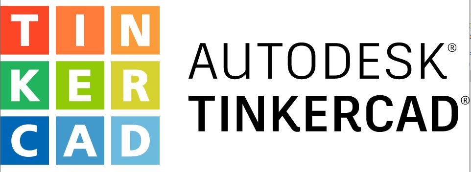
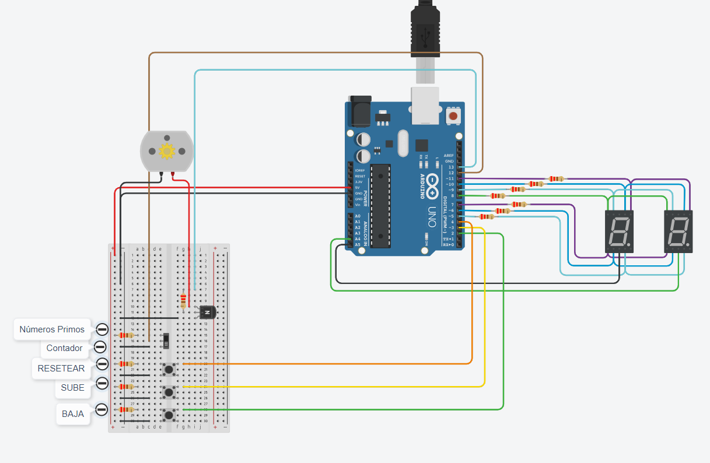
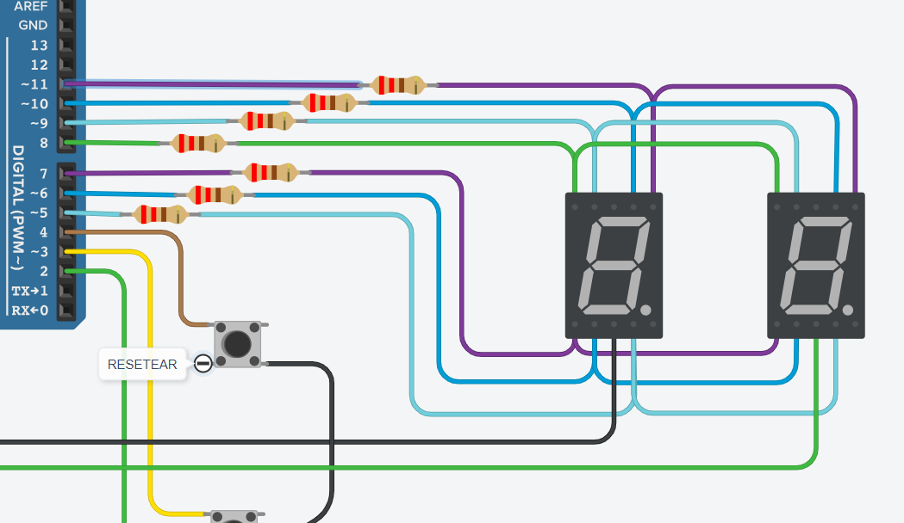

# :file_folder: Primer Parcial de SPD

### :scroll: INTEGRANTES 
-  :strawberry: Grajeda juliana Gimena
*  :bread: Lopez Camilo Garcia
+  :cookie: Loroño Luis Fernando

##  :sunflower: Proyecto Parte Uno: Contador 0 al 99

### 	:computer: Link al Proyecto
[Tinkercad](https://www.tinkercad.com/things/5K5WYnyHAHB)

### Descripción
> Este es el código de un circuito que, gracias a sus botones, puede contar del 0 al 99 y viceversa. Además, cuenta con un botón que te permite resetear el contador a 0 en caso de querer volver a empezar

>**note**
> En ambos codigos utilizamos multiplexación para permitirnos encender los leds de los dos displays a través de la misma conexión de cables.

##  :sunflower: Proyecto Parte Dos: Contador + Interruptor deslizante(SWITCH)

### 	:computer: Link al Proyecto

[Tinkercard](https://www.tinkercad.com/things/0jGSMg5g407)

### Descripción

> Este es un código parecido al anterior solo que ahora tiene un interruptor deslizante que te permite optar por mostrar únicamente numeros primos o contar en el orden correcto

## INVESTIGACIÓN

## Proyecto Parte Dos: Mejoras en el código + Motor + Sensor

### 	:computer: Link al Proyecto

[Tinkercard](https://www.tinkercad.com/things/gtKSZaV5XEU)

### Descripción

>**note**
> En este código agregamos un motor de CC, una placa de pruebas pequeña y un transistor npn

Agregamos un moptor con la única funcionadidad de encenderse cuadno en los leds se muestre un número diferente a 0 y que se apague cuando vuelva a 0(gracias al botón reiniciar). Para realizar esta
función, utilizamos un transistor con el fin de medir el flujo de energía otorgado al motor.

### MULTIPLEXACIÓN

>**note**
> La multiplexación es un proceso en el que se comparten recursos o canales para transmitir múltiples señales o datos a través de un medio limitado o una ruta de comunicación. Este proceso permite la transmisión eficiente de información desde varias fuentes a un destino utilizando una única ruta o canal. 

Basado en la definición de la palabra "Multiplexación" y la aplicación dentro del programa, podemos decir que la misma se utiliza para definir la conexión unica entre varios dispositivos a los mismos pines de entrada/salida. Esto permite la transmisión eficiente de información desde una fuente (el microcontrolador) a múltiples destinos (los displays) utilizando una única ruta o conjunto de pines de control. 

### MOTOR DE CC

#### Definición
> Motor CC: Los motores de corriente continua a menudo se usan con una caja de engranajes para aumentar el torque mientras se mantienen las pequeñas dimensiones. El motor DC es bastante simple de usar. Para que funcione, lo único que hay que hacer es aplicarle voltaje. La señal y el nivel de voltaje determinarán la velocidad y la dirección de rotación.

### MOTOR DE AFICIONADO

#### Definición
> Un motor DC (corriente continua) es un tipo de motor eléctrico que convierte la energía eléctrica de corriente continua en energía mecánica para realizar trabajo, como girar un eje o una rueda. Estos motores son ampliamente utilizados en una variedad de aplicaciones debido a su simplicidad y facilidad de control.

### SENSOR DE FLEXIÓN

#### Definición
>  los sensores de corte y flexión, son unos dispositivos que se instalan en las líneas de alambre . Esto con la finalidad de que emitan una señal si se produce algún cambio en la tensión de las líneas; como, por ejemplo, si son, presionadas, aflojadas o simplemente cortadas.
Los sensores de flexión se utilizan en una variedad de aplicaciones, incluyendo: Robótica, dispositivos medicos, interfaces humano-maquina, control de videojuegos, monitoreo de estructuras, protecis y ortesis, etc.

### SENSOR DE FUERZA

#### Definición
> Los sensores de fuerza, o células de carga, son dispositivos que nos permiten obtener una señal eléctrica proporcional a la fuerza que se aplica sobre ellos. Estos transductores se presentan en múltiples formatos, ya que los requisitos mecánicos de los sistemas en los que se integran son también muy variados

### SENSOR DE TEMPERATURA

#### Definicón
>  Un sensor de temperatura es un equipo diseñado para medir la temperatura, para ello trasforma el valor de la temperatura en una señal eléctrica para que pueda ser leída sin dificultad. Estos dispositivos también son conocidos con el nombre de termosensor o sonda de temperatura.

